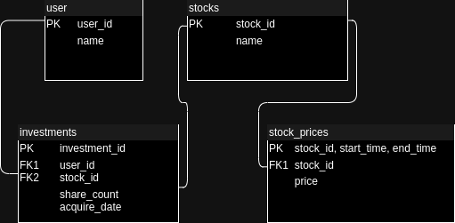
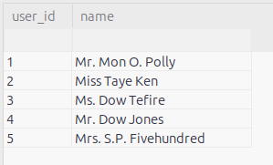
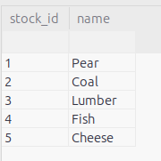
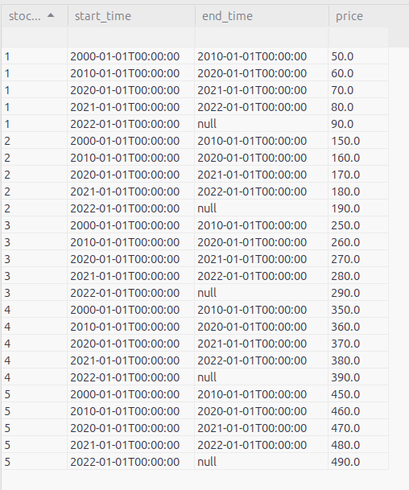
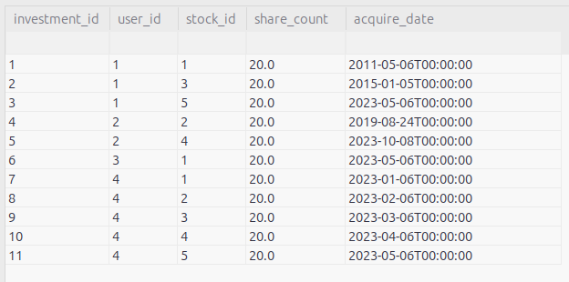

# Investment Performance Web API
This is my solution to the Web API challenge. I built it using C#.NET with a Sqlite database.
I chose to use Sqlite as it makes for an easy portable database.  The database is modeled on:
.

## Test Data

The database is currently loaded up with test data for exploratory purposes.

### User Table
.

### Stock Table
.

### Stock Price Table
.

### Investment Table
.
